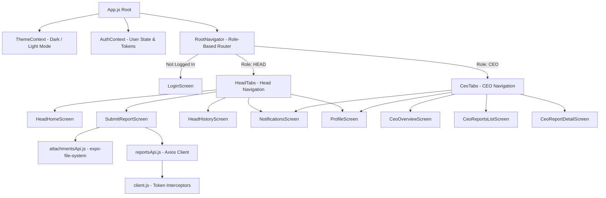

# Karios Reporting Mobile App — Architecture & File-by-File Walkthrough

This document provides a comprehensive, educational breakdown of the entire `mobile/` directory in the **Karios Reporting** repository. It explains the architecture, design choices, data flow, and the exact role each file plays in the mobile application.

---

## 1. High-Level Architecture & Tech Stack



### Core Technologies
* **Framework**: React Native with **Expo (SDK 57)**.
* **Navigation**: **React Navigation v7** using Native Stack and Bottom Tabs.
* **Networking**: **Axios** with custom interceptors for Firebase JWT authentication and automatic token clearance on `401 Unauthorized`.
* **State Management**: **React Context API** (`AuthContext` for authentication/RBAC, `ThemeContext` for dynamic theme swapping).
* **Storage**: `@react-native-async-storage/async-storage` for persisting auth tokens, user profiles, and theme preferences.
* **Native Modules**: `expo-document-picker` for system file access and `expo-file-system/legacy` for streaming binary uploads to Express.

---

## 2. Directory Tree Overview

```text
mobile/
├── App.js                         # Application entrypoint & theme/auth wrapping
├── app.json                       # Expo configuration & app metadata
├── package.json                   # Dependencies & npm scripts
└── src/
    ├── api/                       # API layer: communication with backend
    │   ├── client.js              # Central Axios instance with JWT interceptors
    │   ├── authApi.js             # Authentication endpoints
    │   ├── reportsApi.js          # Reports CRUD & CEO review endpoints
    │   ├── attachmentsApi.js      # Native file upload & MIME validation
    │   ├── dashboardApi.js        # CEO aggregated KPI metrics
    │   └── notificationsApi.js    # In-app alerts & notifications
    ├── components/                # Reusable UI components
    │   ├── StatusBadge.js         # Report status tag (Submitted, Approved, etc.)
    │   ├── DepartmentCard.js      # Department overview tile for CEO
    │   ├── MetricCard.js          # KPI stat box (Revenue, Leads, etc.)
    │   ├── DatePickerModal.js     # Custom calendar modal for report filtering
    │   ├── ReportFilterBar.js     # Search and filter header bar
    │   ├── ThemeToggleBtn.js      # Sun / moon toggle icon
    │   └── KariosLogo.js          # Brand SVG / vector icon
    ├── context/                   # Global React Context providers
    │   ├── AuthContext.js         # User session, login, logout, role checking
    │   └── ThemeContext.js        # Dark / Light theme token provider
    ├── navigation/                # Routing & bottom tab navigators
    │   ├── RootNavigator.js       # Dynamic routing based on authentication & role
    │   ├── HeadTabs.js            # Bottom tabs for Department Heads
    │   └── CeoTabs.js             # Bottom tabs for the CEO
    ├── screens/                   # Page screens
    │   ├── auth/
    │   │   └── LoginScreen.js     # Login with credentials + demo quick-fill buttons
    │   ├── head/
    │   │   ├── HeadHomeScreen.js     # Head dashboard & today's report status
    │   │   ├── SubmitReportScreen.js # Dynamic department form with attachments
    │   │   └── HeadHistoryScreen.js  # Historical submissions list
    │   ├── ceo/
    │   │   ├── CeoOverviewScreen.js    # Executive KPI cards & department breakdown
    │   │   ├── CeoReportsListScreen.js # All submissions across all departments
    │   │   └── CeoReportDetailScreen.js# Full report inspection & Approve/Reject
    │   └── shared/
    │       ├── ProfileScreen.js       # User account details, timezone & sign out
    │       ├── ReportDetailScreen.js  # Read-only report view for department heads
    │       └── NotificationsScreen.js # Alerts & review notifications
    ├── theme/
    │   └── colors.js              # Master color palette (dark & light design tokens)
    └── utils/
        ├── formatters.js          # Currency ($), date, and department formatting
        └── reportForm.js          # Department schemas, required fields & validators
```

---

## 3. File-by-File Detailed Explanation

### Root Files

#### `App.js`
* **What it does**: The root component of the entire mobile application.
* **How it works**:
  * Wraps the application inside `ThemeProvider` and `AuthProvider`.
  * Configures React Navigation's `NavigationContainer` with dynamic theme colors (`navTheme`) matching the current dark/light mode so screen transitions and navigation bars look seamless.
  * Controls the mobile device status bar style (`StatusBar` from Expo) to ensure battery and clock icons remain readable across light and dark modes.

---

### `src/api/` — Backend Networking

#### `src/api/client.js`
* **What it does**: Creates and exports the shared Axios HTTP client used for all backend communication.
* **Key Features**:
  * **Base URL Resolution**: Detects `process.env.EXPO_PUBLIC_API_URL` or defaults to `http://10.0.2.2:4000/api` for the Android emulator (`10.0.2.2` maps to the PC's `localhost` from Android).
  * **Request Interceptor**: Before any request is sent, it reads `karios_token` from `AsyncStorage` and injects `Authorization: Bearer <token>`.
  * **Response Interceptor**: Automatically catches `401 Unauthorized` responses (expired token) and purges the local session to return the user cleanly to the login screen.

#### `src/api/authApi.js`
* **What it does**: Encapsulates authentication endpoints.
* **Key Functions**:
  * `login(email, password)`: Sends `POST /auth/login` and receives the Firebase JWT token and user profile object (`id`, `email`, `role`, `department`, `title`).

#### `src/api/reportsApi.js`
* **What it does**: Manages daily reports CRUD and CEO review actions.
* **Key Functions**:
  * `getFormSchema()`: Fetches the dynamic schema for today's form.
  * `getTodayReport()`: Checks if the logged-in department head has already submitted a report for today.
  * `submitReport({ data, attachmentIds })`: Submits today's daily report (`POST /reports`).
  * `updateReport(id, { data, attachmentIds })`: Updates today's report if still pending (`PATCH /reports/:id`).
  * `getReport(id)`: Fetches a single report with its attachments and CEO review comments.
  * `listReports(filters)`: Queries reports with optional status, department, and date filters.
  * `reviewReport(id, { status, comment })`: Enables the CEO to Approve or Reject a report with comments (`POST /reports/:id/review`).

#### `src/api/attachmentsApi.js`
* **What it does**: Handles native file uploads for supporting documentation (PDFs, screenshots).
* **Key Features**:
  * **MIME Normalization**: Detects `.png`, `.jpg`, `.jpeg`, and `.pdf` extensions and maps them to strict MIME types (`image/png`, `image/jpeg`, `application/pdf`).
  * **Validation**: Validates that files do not exceed 5 MB and fall under allowed types before initiating the upload.
  * **Binary Content Upload**: Uses `FileSystem.uploadAsync` from `expo-file-system/legacy` with `FileSystemUploadType.BINARY_CONTENT` and custom headers `X-File-Name` and `Content-Type`.
  * **Blob Fallback**: Includes a fallback via `fetch(uri).blob()` in case native filesystem streaming encounters platform-specific URI limitations.

#### `src/api/dashboardApi.js`
* **What it does**: Fetches aggregated statistics for the CEO (`GET /dashboard`).
* **Returned Data**: Total revenue closed, total marketing spend, active blockers across departments, and daily submission rates.

#### `src/api/notificationsApi.js`
* **What it does**: Fetches system alerts and notifications (`GET /notifications`, `PATCH /notifications/:id/read`).

---

### `src/context/` — State Management

#### `src/context/AuthContext.js`
* **What it does**: Provides application-wide user identity and login state.
* **Key State & Methods**:
  * `user`: The current user object containing `email`, `role` (`HEAD` or `CEO`), `department`, and `title`.
  * `isCEO`: Convenience boolean (`user?.role === 'CEO'`).
  * `signIn(email, password)`: Calls `authApi.login()`, saves token and user in `AsyncStorage`, and updates context state.
  * `signOut()`: Clears `AsyncStorage` and sets `user` to `null`, instantly directing the router back to `LoginScreen`.

#### `src/context/ThemeContext.js`
* **What it does**: Powers the Dark Mode / Light Mode theme engine.
* **Key State & Methods**:
  * `isDark`: Boolean indicating whether dark mode is currently active.
  * `colors`: The active color token dictionary (e.g. `colors.background`, `colors.surface`, `colors.primary`, `colors.border`).
  * `toggleTheme()`: Inverts current theme mode and persists the preference in `AsyncStorage` under `karios_theme_mode`.

---

### `src/navigation/` — Routing & Tab Systems

#### `src/navigation/RootNavigator.js`
* **What it does**: The root navigation stack determining which view the user sees.
* **Flow**:
  1. If `user == null`: Renders `LoginScreen`.
  2. If `user.role === 'CEO'`: Renders `CeoTabs` + `CeoReportDetailScreen`.
  3. If `user.role === 'HEAD'`: Renders `HeadTabs` + `ReportDetailScreen` + `SubmitReportScreen`.

#### `src/navigation/HeadTabs.js`
* **What it does**: Bottom tab bar configured for Department Heads (`DEVELOPMENT`, `SALES`, `MARKETING`, `FINANCE`).
* **Tabs**:
  * **Home**: `HeadHomeScreen`
  * **Submit**: `SubmitReportScreen`
  * **History**: `HeadHistoryScreen`
  * **Alerts**: `NotificationsScreen`
  * **Account**: `ProfileScreen`

#### `src/navigation/CeoTabs.js`
* **What it does**: Bottom tab bar configured exclusively for the executive CEO view.
* **Tabs**:
  * **Overview**: `CeoOverviewScreen` (KPI summary & department status)
  * **Reports**: `CeoReportsListScreen` (All company reports)
  * **Alerts**: `NotificationsScreen`
  * **Account**: `ProfileScreen`

---

### `src/screens/` — UI Screens

#### `src/screens/auth/LoginScreen.js`
* **What it does**: User authentication interface.
* **Features**:
  * Email and password inputs with field validation.
  * **Demo Quick-Fill Buttons**: One-tap login presets for `CEO`, `Engineering Head`, `Sales Head`, `Marketing Head`, and `Finance Head`, enabling fast testing without manual typing.
  * Loading state feedback and clear error popups on invalid credentials.

#### `src/screens/head/HeadHomeScreen.js`
* **What it does**: Main landing dashboard for a department head.
* **Features**:
  * **Today's Status Card**: Displays whether today's report is `MISSING`, `SUBMITTED`, `APPROVED`, or `REJECTED`.
  * **Action Button**: Contextual button to either "Submit Daily Report" or "Edit Report".
  * **KPI Summary Cards**: Department-specific counters (e.g. Bugs Fixed for Dev, Deals for Sales, Spend for Marketing).
  * **Recent Submissions Preview**: Compact list of past reports with status indicators.

#### `src/screens/head/SubmitReportScreen.js`
* **What it does**: Dynamic daily report submission and editing screen.
* **Features**:
  * **Dynamic Form Rendering**: Dynamically generates fields based on `getDepartmentFields(dept)` from `reportForm.js`.
  * **Mandatory Field Indicators**: Required fields are marked with red asterisks (`*`) and validated on submit.
  * **USD Currency Inputs**: Monetary fields display `in USD ($)` and `$` labels.
  * **Native Document Picker**: Allows picking PDFs or screenshots (`expo-document-picker`), uploads them as binary attachments to the backend, displays attached file chips with size and name, and allows removing files before submission.
  * **Pre-population**: If editing an existing report, preloads all values and attached files automatically.

#### `src/screens/head/HeadHistoryScreen.js`
* **What it does**: Historical archive of all past daily reports for the logged-in department.
* **Features**:
  * Date filtering and status chip filtering (All, Approved, Pending, Rejected).
  * Pull-to-refresh list with status badges and submission timestamps in IST.
  * Tap to inspect report details or edit rejected reports.

#### `src/screens/ceo/CeoOverviewScreen.js`
* **What it does**: Executive summary dashboard for the CEO.
* **Features**:
  * High-level KPI metrics (Total Revenue, Spend, Bugs Fixed, Leads Generated).
  * Department Status Grid showing today's submission state for Development, Sales, Marketing, and Finance.
  * Active Blockers feed alerting the CEO to impediments needing executive intervention.

#### `src/screens/ceo/CeoReportsListScreen.js`
* **What it does**: Full company-wide report log for the CEO.
* **Features**:
  * Filter by department tab (`ALL`, `DEV`, `SALES`, `MKTG`, `FIN`).
  * Filter by status (`APPROVED`, `SUBMITTED`, `REJECTED`).
  * Direct navigation into `CeoReportDetailScreen` for individual review.

#### `src/screens/ceo/CeoReportDetailScreen.js`
* **What it does**: Executive report inspection and review workspace.
* **Features**:
  * Complete breakdown of department metrics and tasks.
  * **Supporting Attachments Card**: Lists attached PDFs and images with file icons and sizes.
  * **Review Action Sheet**: Enables the CEO to Approve or Reject a report with a mandatory note for rejections and optional commendations for approvals.

#### `src/screens/shared/ReportDetailScreen.js`
* **What it does**: Detailed view of a single report for department heads.
* **Features**:
  * Shows department metrics, blockers, plan for tomorrow, and CEO review remarks.
  * Lists supporting attachments.
  * Includes an "Edit This Report" button if the report is not yet approved.

#### `src/screens/shared/ProfileScreen.js`
* **What it does**: User profile and account preferences page.
* **Features**:
  * Unified card displaying user avatar letter, full role title, and official department.
  * Header theme toggle (Sun/Moon icon).
  * Timezone indicator: `Asia/Kolkata (IST)` formatted cleanly.
  * Outlined, high-visibility Sign Out button.

#### `src/screens/shared/NotificationsScreen.js`
* **What it does**: In-app notifications feed.
* **Features**:
  * Real-time alerts regarding approved reports, rejected reports with feedback, and submission reminders.

---

### `src/components/` — Shared Reusable Widgets

* **`src/components/StatusBadge.js`**: Renders colored pill badges for report status: `SUBMITTED` (amber), `APPROVED` (emerald green), `REJECTED` (rose red), and `MISSING` (slate gray).
* **`src/components/DepartmentCard.js`**: Reusable department summary card showing department letter badge, name, head title, and status pill.
* **`src/components/MetricCard.js`**: KPI summary card displaying icon, title, formatted value, and subtle background accent.
* **`src/components/ThemeToggleBtn.js`**: Minimalist top-bar icon button switching between sunny and starry night modes.
* **`src/components/DatePickerModal.js`**: Accessible calendar sheet allowing date selection for historical report filtering.
* **`src/components/ReportFilterBar.js`**: Horizontal filter bar with search text input, date pickers, and status pills.
* **`src/components/KariosLogo.js`**: Brand identity icon rendered across headers and login cards.

---

### `src/theme/` & `src/utils/` — Design Tokens & Business Logic

#### `src/theme/colors.js`
* **What it does**: Design system containing all light and dark theme palette tokens.
* **Tokens**:
  * `primary`: `#8B5CF6` (Vibrant Purple).
  * `approved`: `#10B981` (Emerald).
  * `pending`: `#F59E0B` (Amber).
  * `rejected`: `#EF4444` (Rose).
  * Surface and background colors tailored for OLED dark mode and crisp daylight contrast.

#### `src/utils/formatters.js`
* **What it does**: Formatting utilities ensuring consistent representation across the app.
* **Functions**:
  * `formatCurrency(val, '$')`: Formats numbers into currency strings (e.g., `$150K`, `$1.2M`, `$450`).
  * `formatISTTime(iso)`: Converts timestamps to `en-IN` format with `Asia/Kolkata` timezone.
  * `formatRelativeDate(dateStr)`: Converts date strings into `'Today'`, `'Yesterday'`, or `'Oct 6, 2026'`.
  * `departmentLabel()` & `departmentLetter()`: Standardizes department tags across UI badges.

#### `src/utils/reportForm.js`
* **What it does**: Defines the form fields schema for each department and handles input validation.
* **Schemas**:
  * **DEVELOPMENT**: Tasks Completed (`*`), Tasks in Progress, Bugs Fixed, Deployments, Blockers, Plan for Tomorrow (`*`).
  * **SALES**: New Leads (`*`), Follow-ups, Deals Closed, Revenue Closed in USD (`*`), Pipeline Value in USD, Blockers, Plan for Tomorrow (`*`).
  * **MARKETING**: Active Campaigns (`*`), Marketing Spend in USD (`*`), Impressions, Clicks, Leads Generated, Blockers, Plan for Tomorrow (`*`).
  * **FINANCE**: Collections in USD (`*`), Payments Made in USD, Expenses in USD (`*`), Pending Invoices, Cash Position in USD (`*`), Blockers, Notes.
* **Validators**:
  * `buildReportData()`: Validates required inputs, ensures numeric bounds, checks 2-decimal precision for currency, and constructs the clean JSON payload for the backend.

---

## 4. Key Takeaways & Best Practices Demonstrated

1. **Role-Based Navigation in Mobile**: Instead of conditional renders within a single screen, `RootNavigator` switches entire navigation trees based on the user's role (`CEO` vs `HEAD`).
2. **Dynamic Forms**: Rather than creating four distinct submit screens for each department, `SubmitReportScreen` dynamically renders from `reportForm.js` schemas while sharing state management, styling, and attachment logic.
3. **True Binary File Uploads**: By streaming raw binary bytes with `expo-file-system/legacy` and setting `Content-Type` and `X-File-Name` headers, the mobile app interacts cleanly with Express's `express.raw()` middleware without heavyweight multipart parsers.
4. **Theme Context without Screen Rerendering**: Leveraging a single `useTheme()` hook allows individual styles to react instantly to theme toggles while maintaining fast native performance.
